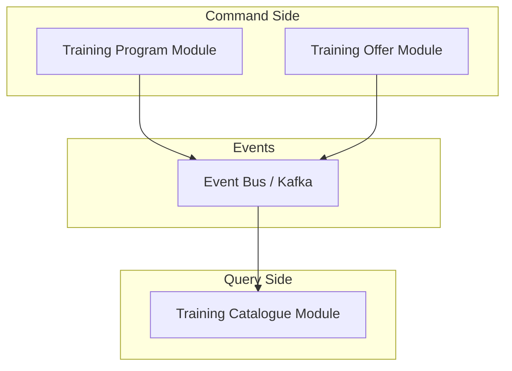
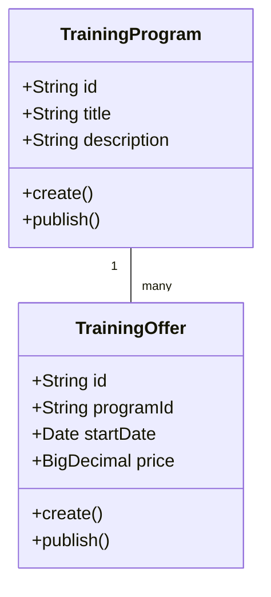
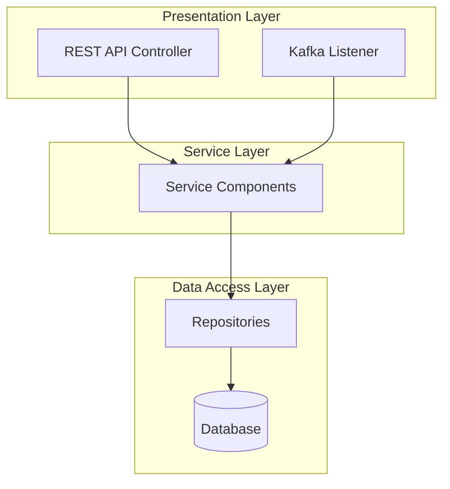

# Using Mermaid Diagrams in Architecture Decision Records

## Overview

This guide explains how to use Mermaid diagrams in Architecture Decision Records (ADRs) to visualize architecture decisions. Mermaid is a JavaScript-based diagramming and charting tool that renders Markdown-inspired text definitions to create diagrams.

## Why Mermaid?

Mermaid was chosen for our ADRs because:
- It's directly supported in many Markdown environments (GitHub, GitLab, etc.)
- The syntax is simple and readable
- It supports various diagram types needed for architecture visualization
- It doesn't require external tools or services to render
- Diagrams are stored as text, making them version-control friendly

## How to Add a Mermaid Diagram to an ADR

1. In your ADR Markdown file, add a code block with the `mermaid` language specifier:

```
```mermaid
// Your diagram code here
```
```

2. Write your diagram code using Mermaid syntax.

## Diagram Types for Architecture Decisions

### Flowcharts

Flowcharts are useful for visualizing the flow of data or control between components.

Example (CQRS pattern):



### Class Diagrams

Class diagrams are useful for visualizing domain models and entity relationships.

Example:



### Component Diagrams

Component diagrams are useful for visualizing the structure of a system.

Example (Layered Architecture):



## Styling Guidelines

To maintain consistency across ADRs, follow these styling guidelines:

1. Use color coding to distinguish between different types of components:
   ```
   classDef command fill:#f96,stroke:#333,stroke-width:2px
   classDef query fill:#9cf,stroke:#333,stroke-width:2px
   
   class CommandComponent command
   class QueryComponent query
   ```

2. Use meaningful names for nodes and clear labels.

3. Group related components using subgraphs.

4. Use directional arrows to show the flow of data or control.

5. Keep diagrams focused on the key architectural decision being documented.

## Examples from Existing ADRs

For examples of Mermaid diagrams in action, see:

- [0017-cqrs-usage.md](./records/0017-cqrs-usage.md) - CQRS pattern across modules
- [0016-code-architecture-for-training-catalogue.md](./records/0016-code-architecture-for-training-catalogue.md) - Layered Architecture
- [0015-code-architecture-for-reviews-service.md](./records/0015-code-architecture-for-reviews-service.md) - Port and Adapters Architecture with DDD

## Resources

- [Mermaid Official Documentation](https://mermaid-js.github.io/mermaid/#/)
- [Mermaid Live Editor](https://mermaid.live/) - Useful for testing diagrams before adding them to ADRs