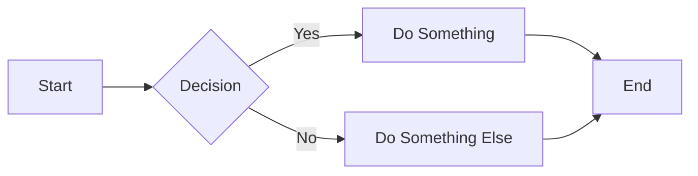
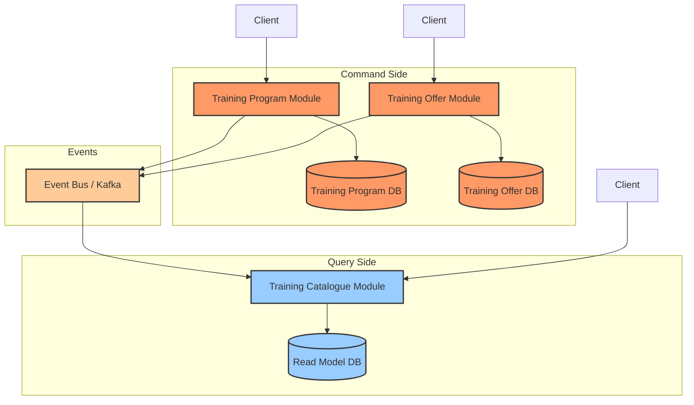
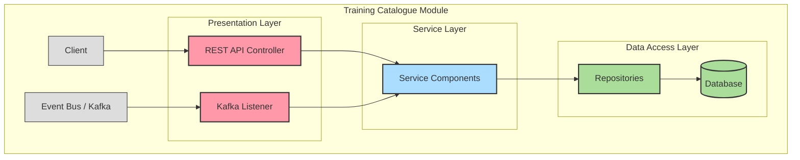
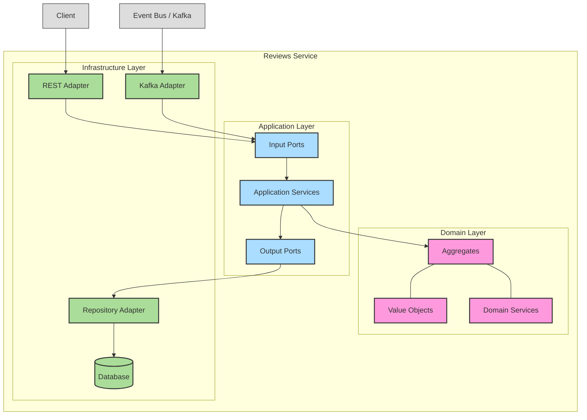

# Mermaid Diagram Rendering Test

This file is for testing that Mermaid diagrams render correctly in your Markdown environment.

## Test Diagrams

### Simple Flowchart

### CQRS Pattern (from ADR 0017)

### Layered Architecture (from ADR 0016)

### Port and Adapters with DDD (from ADR 0015)

## How to Test Rendering

To verify that the diagrams render correctly:

1. **GitHub**: Push this file to a GitHub repository and view it on GitHub.com.

2. **GitLab**: Push this file to a GitLab repository and view it on GitLab.com.

3. **IDE Preview**: Use the Markdown preview feature in your IDE (e.g., IntelliJ IDEA, VS Code).

4. **Mermaid Live Editor**: Copy the Mermaid code blocks to [Mermaid Live Editor](https://mermaid.live/) to verify syntax.

If the diagrams don't render correctly in your preferred Markdown environment, you may need to:

- Check if Mermaid is supported in that environment
- Verify the Mermaid syntax is correct
- Consider using a different Markdown environment that supports Mermaid

## Troubleshooting

If diagrams don't render:

1. Ensure there are no syntax errors in the Mermaid code.
2. Check that the triple backticks and `mermaid` language specifier are correctly formatted.
3. Verify that your Markdown viewer supports Mermaid diagrams.
4. Try viewing the file in a different environment (e.g., GitHub, GitLab, VS Code).

For GitHub repositories, you may need to enable Mermaid support in your repository settings.