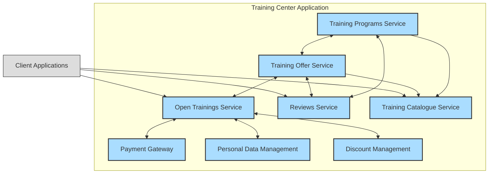

# 0001: Architecture of the Training Center Application

## Status

Accepted

## Date

2024-12-15

## Decision

Use a Microservices Architecture for the Training Center Application.

## Context

* We are developing a new application for our training center.
* The application needs to be scalable, flexible, and able to accommodate future growth and evolving business requirements.
* The application will encompass various functionalities such as course management, student enrollment, instructor scheduling, payment processing, and reporting.

## Solutions

### Microservices Architecture

* Decompose the application into small, independent services that communicate with each other via APIs.
* Each service focuses on a specific business capability.
* Offers high scalability, flexibility, and independent deployment.
* May introduce increased complexity in terms of development, testing, and operations.

### Modular Monolith

* A single application with well-defined modules and boundaries.
* Offers simpler development and deployment compared to microservices.
* May have limitations in terms of scalability and independent scaling of individual components.

## Decision Rationale

* **Scalability** - Microservices architecture allows for independent scaling of individual services based on demand, ensuring optimal resource utilization.
* **Flexibility** - Individual services can be developed, deployed, and updated independently, enabling faster iterations and quicker time-to-market for new features.
* **Fault Isolation** - If one service fails, it does not necessarily bring down the entire application.
* **Technology Diversity** - Microservices architecture allows for the use of different technologies for different services, enabling the use of the best tool for each job.

## Consequences

* **Increased complexity** - Requires careful design, development, and testing of inter-service communication and data consistency.
* **Operational overhead** - Increased operational overhead for managing and monitoring multiple services.
* **Potential for distributed systems challenges** - Requires careful consideration of issues like network latency, data consistency, and distributed transactions.

### Positive Risks and Considerations

* The potential for increased agility and innovation due to the independent development and deployment of services.
* The ability to leverage the strengths of different technologies and teams.

### Negative Risks and Considerations:

* The potential for increased operational complexity and the risk of introducing unintended side effects due to inter-service dependencies.
* The potential for increased development and testing effort due to the distributed nature of the system.