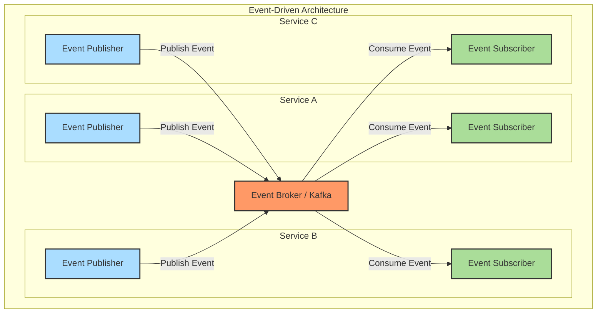

# 0003: Event-Driven Architecture

## Status

Accepted

## Date

2024-12-17

## Decision

Implement an Event-Driven Architecture (EDA) for communication between services and components.

## Context

* Our application is built as a microservices architecture with multiple independent services.
* Services need to communicate and share data while remaining loosely coupled.
* Business processes often span multiple services and require coordination.
* We need a scalable and resilient communication mechanism that supports asynchronous processing.

## Solutions

### Event-Driven Architecture

* Services communicate by producing and consuming events.
* Events represent facts that have occurred in the system.
* Services publish events when their state changes and subscribe to events they are interested in.
* Events are immutable and represent a record of something that has happened.

### Request-Response Communication

* Services communicate directly with each other through synchronous API calls.
* Each service exposes an API that other services can call.
* Communication is immediate and blocking.

### Shared Database

* Services share a common database to exchange data.
* Changes made by one service are immediately visible to other services.
* No explicit communication mechanism is needed.

## Decision Rationale

* **Loose Coupling** - Services only need to know about the events they produce and consume, not about other services directly.
* **Scalability** - Event producers and consumers can scale independently, and event processing can be parallelized.
* **Resilience** - If a service is temporarily unavailable, events can be buffered and processed when the service recovers.
* **Temporal Decoupling** - Services don't need to be available at the same time to communicate, enabling asynchronous processing.
* **Audit Trail** - Events provide a natural audit trail of all changes in the system.
* **Event Sourcing Compatibility** - EDA aligns well with event sourcing, which we use in some parts of our system.

## Consequences

* **Eventual Consistency** - The system will be eventually consistent, which may require additional consideration in the UI and user experience design.
* **Increased Complexity** - Managing event schemas, versioning, and ensuring reliable delivery adds complexity.
* **Debugging Challenges** - Tracing the flow of events across services can be more challenging than tracing synchronous calls.

### Positive Risks and Considerations

* The loose coupling between services enables independent development and deployment, potentially accelerating the development process.
* Events provide a natural way to implement features like notifications, analytics, and audit trails.
* The architecture naturally supports the implementation of CQRS and event sourcing patterns.

### Negative Risks and Considerations

* Ensuring reliable event delivery and processing requires careful design and infrastructure.
* Managing event schemas and versioning becomes critical as the system evolves.
* Developers need to adopt an event-centric mindset, which may require training and adjustment.