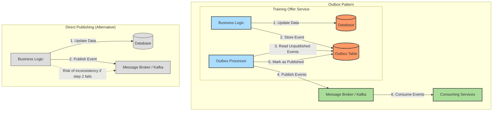

# 0009: Outbox Pattern for Reliable Event Publishing in Training Offer Service

## Status

Accepted

## Date

2024-12-20

## Decision

Implement the Outbox Pattern to ensure reliable event publishing in the Training Offer service.

## Context

* The Training Offer service uses an event-driven architecture where it communicates with other services through events.
* The service needs to publish events such as TrainingOfferPublishedEvent when a training offer is published.
* Ensuring reliable event delivery is critical for maintaining data consistency across services.
* We need to avoid the dual-write problem where the service might update its database but fail to publish an event.
* Events must be published exactly once to avoid duplicate processing.
* The system should be resilient to temporary failures in the messaging infrastructure.

## Solutions

### Outbox Pattern

* When the Training Offer service needs to publish an event, it first stores the event in an "outbox" table within its own database as part of the same transaction that updates the service's state.
* A separate process periodically polls the outbox table for unpublished events, publishes them to the message broker, and marks them as published.
* This ensures that the database update and event creation are atomic, and the event will eventually be published even if there are temporary failures.

### Direct Publishing

* The service publishes events directly to the message broker after updating its database.
* This approach is simpler but can lead to inconsistencies if the event publishing fails after the database update succeeds.

### Two-Phase Commit

* Use a distributed transaction protocol to ensure atomicity between the database update and event publishing.
* This approach is complex and may not be supported by all message brokers.

## Decision Rationale

* **Data Consistency** - The outbox pattern ensures that database updates and event publishing are atomic, preventing inconsistencies.
* **Reliability** - Events are guaranteed to be published even if there are temporary failures in the messaging infrastructure.
* **Exactly-Once Semantics** - The pattern helps ensure that events are published exactly once, avoiding duplicate processing.
* **Simplicity** - The pattern is relatively simple to implement and doesn't require distributed transactions.
* **Compatibility** - The pattern works with any message broker and doesn't require special transaction support.
* **Consistency with Other Services** - Using the same pattern as the Open Trainings service ensures consistency across our codebase, making it easier for developers to work across different services.

## Consequences

* **Increased Latency** - There may be a delay between the database update and the event being published, as the outbox processor runs periodically.
* **Additional Complexity** - The system needs an additional component to poll the outbox and publish events.
* **Database Load** - The outbox table and polling process add some load to the database.

### Positive Risks and Considerations

* The pattern naturally provides an audit trail of all events that have been published.
* The pattern can be extended to support event ordering and idempotent processing.
* The outbox table can be used for debugging and monitoring purposes.
* Consistency with other services in the system simplifies the overall architecture.

### Negative Risks and Considerations

* If the outbox processor fails for an extended period, there may be a large backlog of events to process.
* The pattern requires careful handling of failures in the outbox processor to avoid lost or duplicate events.
* Additional monitoring is needed to ensure the outbox processor is functioning correctly.