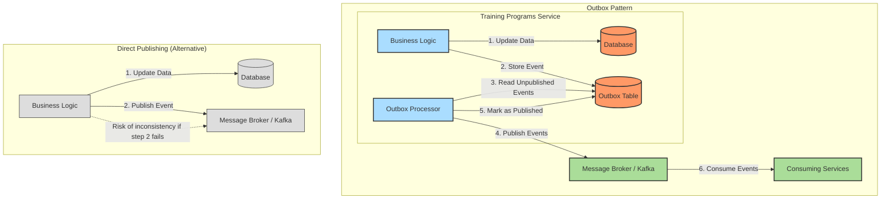

# 0011: Outbox Pattern for Reliable Event Publishing in Training Programs Service

## Status

Accepted

## Date

2024-12-30

## Decision

Implement the Outbox Pattern to ensure reliable event publishing in the Training Programs service.

## Context

* The Training Programs service uses an event-driven architecture where it communicates with other services through events.
* The service needs to publish events such as TrainingProgramProposedEvent when a training program proposal is created.
* Ensuring reliable event delivery is critical for maintaining data consistency across services.
* We need to avoid the dual-write problem where the service might update its database but fail to publish an event.
* Events must be published exactly once to avoid duplicate processing.
* The system should be resilient to temporary failures in the messaging infrastructure.

## Solutions

### Outbox Pattern:
* Store events in an outbox table as part of the same database transaction that updates the domain entities.
* Use a separate process to poll the outbox table and publish events to the message broker.
* Mark events as published once they are successfully sent.

### Direct Event Publishing:
* Publish events directly from the application service after updating the database.
* Risk of inconsistency if the event publishing fails after the database update.

### Distributed Transactions (2PC):
* Use two-phase commit to ensure both database update and event publishing succeed or fail together.
* Introduces complexity and performance overhead.
* Not all message brokers support distributed transactions.

### Event Sourcing:
* Store all changes as a sequence of events.
* More complex to implement and may not be suitable for all use cases.

## Decision Rationale

* **Data Consistency** - The outbox pattern ensures that database updates and event publishing are atomic, preventing inconsistencies.
* **Reliability** - Events are guaranteed to be published even if there are temporary failures in the messaging infrastructure.
* **Exactly-Once Semantics** - The pattern helps ensure that events are published exactly once, avoiding duplicate processing.
* **Simplicity** - The pattern is relatively simple to implement and doesn't require distributed transactions.
* **Compatibility** - The pattern works with any message broker and doesn't require special transaction support.
* **Consistency with Other Services** - Using the same pattern as the Open Trainings and Training Offer services ensures consistency across our codebase, making it easier for developers to work across different services.

## Consequences

* **Increased Latency** - There may be a delay between the database update and the event being published, as the outbox processor runs periodically.
* **Additional Complexity** - The system needs an additional component to poll the outbox and publish events.
* **Database Load** - The outbox table and polling process add some load to the database.

### Positive Risks and Considerations:

* The pattern naturally provides an audit trail of all events that have been published.
* The pattern can be extended to support event ordering and idempotent processing.
* The outbox table can be used for debugging and monitoring purposes.
* Consistency with other services in the system simplifies the overall architecture.

### Negative Risks and Considerations:

* If the outbox processor fails for an extended period, there may be a large backlog of events to process.
* The pattern requires careful handling of failures in the outbox processor to avoid lost or duplicate events.
* Additional monitoring is needed to ensure the outbox processor is functioning correctly.