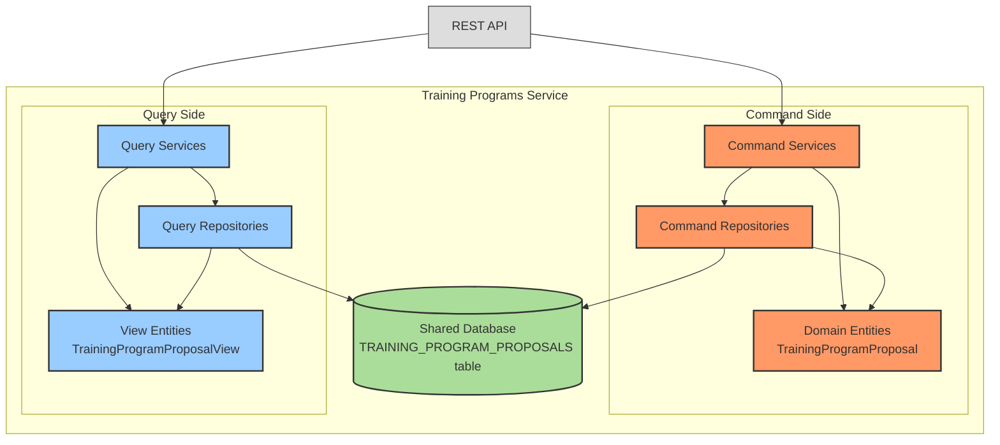

# 0013: CQRS Implementation for Training Programs Service

## Status

Accepted

## Date

2024-12-30

## Decision

Implement CQRS (Command Query Responsibility Segregation) pattern within the Training Programs service using a shared database approach with code-level separation between commands and queries.

## Context

* The Training Programs service manages training program proposals as core business entities with requirements for both complex write operations and optimized read operations.
* We need to support efficient query operations for listing and filtering training program proposals while maintaining transactional integrity for creation and modification operations.
* The service requires clear separation of concerns between data modification (proposal creation, updates) and data retrieval (proposal listing, filtering, reporting).
* We want to maintain operational simplicity by avoiding the complexity of separate read and write databases while still achieving the architectural benefits of CQRS.
* The system needs to support different optimization strategies for read versus write operations without introducing significant operational overhead.

## Solutions

### Shared Database CQRS:
* Use the same database tables for both read and write operations.
* Separate responsibilities at the code level with distinct packages and annotations.
* Domain entities handle write operations, view entities handle read operations.
* Both entity types map to the same database tables but serve different architectural purposes.

### Separate Database CQRS:
* Maintain separate read and write databases.
* Synchronize data between databases using event-driven mechanisms.
* Allows independent scaling and optimization of read vs write operations.

### No CQRS Pattern:
* Use the same entities and repositories for both read and write operations.
* Simpler approach but less flexibility for optimization and separation of concerns.

## Decision Rationale

* **Architectural Consistency** - Aligns with the shared database CQRS pattern used across other services (Open Trainings, Training Offers) ensuring consistency in our system architecture.
* **Clear Separation of Concerns** - Code-level separation between queries (read operations) and commands (write operations) improves maintainability and code organization.
* **Optimized Query Models** - Query-specific view entities can be tailored for efficient data retrieval and presentation without affecting the domain model structure.
* **Operational Simplicity** - Using the same database maintains ACID properties and avoids the complexity of data synchronization between separate databases.
* **Performance Benefits** - Read operations can be optimized independently through specialized queries, indexing strategies, and caching without impacting write performance.
* **Testability Enhancement** - Clear separation enables independent testing of command and query operations, improving test coverage and reliability.
* **Future Flexibility** - Provides a foundation for potential migration to separate databases if scaling requirements change.

## Consequences

* **Package Structure** - The service maintains distinct packages: `query` for read operations and `application`/`domain` for write operations.
* **Annotation-Based Classification** - Uses `@QueryOperation` and `@CommandOperation` annotations to clearly identify operation types.
* **Dual Entity Mapping** - Domain entities (`TrainingProgramProposal`) and view entities (`TrainingProgramProposalView`) both map to the same database table (`TRAINING_PROGRAM_PROPOSALS`).
* **Repository Separation** - Separate repository interfaces for command operations (`TrainingProgramProposalRepository`) and query operations (`TrainingProgramProposalViewRepository`).

### Positive Risks and Considerations:

* Enhanced query performance through specialized view models and optimized query patterns.
* Improved maintainability with clear architectural boundaries between read and write operations.
* Better testability of individual operations and clearer test organization.
* Flexibility to evolve read and write models independently based on specific requirements.
* Consistency with other services simplifies overall system understanding and maintenance.
* Foundation for future architectural evolution if separate databases become necessary.

### Negative Risks and Considerations:

* Potential for code duplication between domain entities and view entities sharing the same table structure.
* Need to carefully maintain consistency between entities that map to the same database tables.
* Additional cognitive overhead in understanding when to use domain entities versus view entities.
* Risk of inadvertently using incorrect entity type for specific operations, potentially impacting performance or functionality.