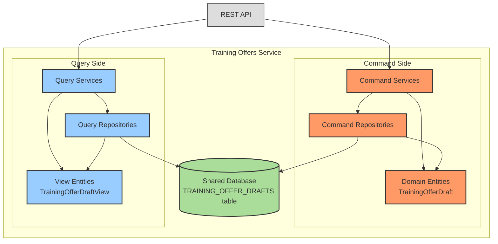

# 0014: CQRS Implementation for Training Offers Service

## Status

Accepted

## Date

2024-12-30

## Decision

Implement CQRS (Command Query Responsibility Segregation) pattern within the Training Offers service using a shared database approach with code-level separation between commands and queries.

## Context

* The Training Offers service manages training offer drafts as core business entities with complex workflows involving creation, modification, and retrieval operations.
* We need to support efficient query operations for browsing and searching training offer drafts while maintaining transactional integrity for draft creation and modification processes.
* The service requires clear separation of concerns between data modification (draft creation, updates, workflow transitions) and data retrieval (draft listing, searching, reporting).
* We want to maintain operational simplicity and consistency with other services by avoiding the complexity of separate read and write databases while still achieving CQRS architectural benefits.
* The system needs to support different optimization strategies for read versus write operations, particularly for complex draft management workflows.

## Solutions

### Shared Database CQRS:
* Use the same database tables for both read and write operations.
* Separate responsibilities at the code level with distinct packages and annotations.
* Domain entities handle write operations and business logic, view entities handle read operations and presentation.
* Both entity types map to the same database tables but serve different architectural purposes.

### Separate Database CQRS:
* Maintain separate read and write databases.
* Synchronize data between databases using event-driven mechanisms.
* Allows independent scaling and optimization of read vs write operations.

### No CQRS Pattern:
* Use the same entities and repositories for both read and write operations.
* Simpler approach but less flexibility for optimization and separation of concerns.

## Decision Rationale

* **System-Wide Consistency** - Maintains architectural consistency with the shared database CQRS pattern used across other core services (Open Trainings, Training Programs) ensuring uniform system architecture.
* **Clear Separation of Concerns** - Code-level separation between queries (read operations) and commands (write operations) improves code organization, maintainability, and developer productivity.
* **Optimized Query Models** - Query-specific view entities can be optimized for efficient data retrieval and presentation requirements without constraining the domain model design.
* **Operational Simplicity** - Using the same database ensures ACID properties are maintained and avoids the operational complexity of managing data synchronization between separate databases.
* **Performance Optimization** - Read operations can be independently optimized through specialized queries, caching strategies, and indexing without impacting write operation performance.
* **Enhanced Testability** - Clear architectural separation enables independent testing of command and query operations, improving test coverage and system reliability.
* **Business Logic Isolation** - Domain entities can focus on business rules and workflows while view entities optimize for data presentation and reporting needs.

## Consequences

* **Architectural Structure** - The service maintains distinct packages: `query` for read operations and `application`/`domain` for write operations and business logic.
* **Operation Classification** - Uses `@QueryOperation` and `@CommandOperation` annotations to clearly identify and separate operation types.
* **Dual Entity Mapping** - Domain entities (`TrainingOfferDraft`) and view entities (`TrainingOfferDraftView`) both map to the same database table (`TRAINING_OFFER_DRAFTS`).
* **Repository Segregation** - Separate repository interfaces for command operations (`TrainingOfferDraftRepository`) and query operations (`TrainingOfferDraftViewRepository`).

### Positive Risks and Considerations:

* Improved query performance through specialized view models and optimized data access patterns.
* Enhanced maintainability with clear architectural boundaries and separation of responsibilities.
* Better testability with distinct testing strategies for command and query operations.
* Flexibility to evolve read and write models independently to meet changing business requirements.
* Consistency across services simplifies system maintenance, onboarding, and cross-team collaboration.
* Solid foundation for future architectural evolution if separate databases become necessary for scaling.
* Clear separation supports different caching strategies for read versus write operations.

### Negative Risks and Considerations:

* Potential code duplication between domain entities and view entities that share the same database table structure.
* Increased complexity in maintaining consistency between entities that map to the same database tables.
* Additional cognitive overhead for developers in understanding when to use domain entities versus view entities.
* Risk of using incorrect entity type for specific operations, which could impact performance or introduce bugs.
* Need for careful coordination when making schema changes that affect both entity types.