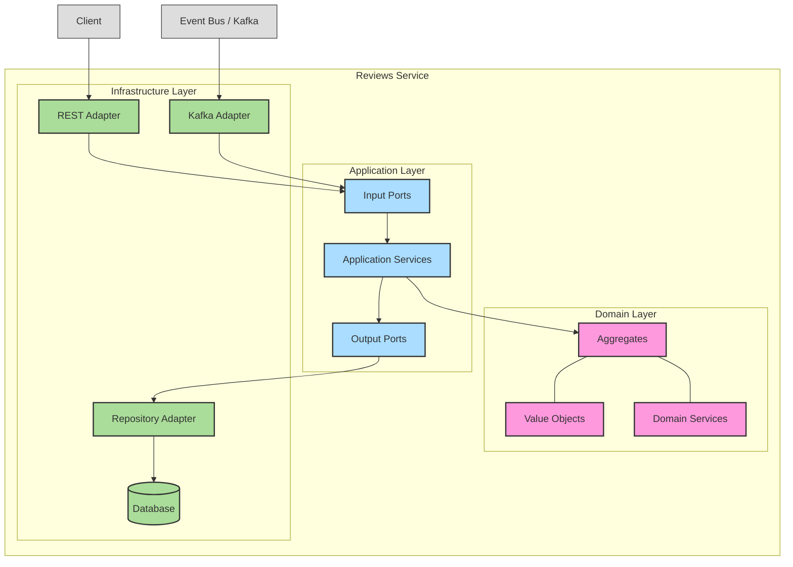

# 0015: Code Architecture for Reviews Service

## Status

Accepted

## Date

2025-07-17

## Decision

Use Port and Adapters Architecture with the usage of Tactical Domain-Driven Design (DDD) patterns.

## Context

* We are developing a service responsible for managing reviews and proposals, including registration, approval, and rejection of proposals.
* This service is responsible for the business logic of the review process, which is an important domain as it directly impacts the quality of our training offerings.
* We need to choose a code architecture that promotes maintainability, testability, and flexibility in the face of evolving business requirements.

## Solutions

### Port and Adapters Architecture with DDD:
* Isolate the domain logic from external concerns (databases, message queues, etc.) using ports and adapters.
* Utilize DDD patterns (e.g., Aggregates, Value Objects, Repositories) to model the domain effectively and ensure high cohesion and low coupling.

### Port and Adapters Architecture without DDD:
* Isolate the domain logic, but without the specific benefits of DDD patterns for domain modeling.

### Layered Architecture:
* Organize the code into layers (e.g., presentation, application, domain, infrastructure).
* May lead to tighter coupling between layers compared to port and adapters.

### No Architecture:
* Proceed with development without a defined architectural style.
* Can lead to technical debt and increased maintenance costs in the long run.

## Decision Rationale

* **Domain Importance** - As the review process is an important business domain, it's crucial to have a robust architecture that facilitates maintainability, extensibility, and the ability to adapt to changing business needs.
* **Domain Isolation** - Port and Adapters architecture effectively isolates the core domain logic from external concerns, making it easier to test, maintain, and evolve independently.
* **DDD for Domain Modeling** - Utilizing DDD patterns helps to create a rich and expressive domain model, improving code clarity, reducing complexity, and facilitating better communication within the development team.
* **Encapsulation** - DDD patterns promote encapsulation of domain logic, making it less susceptible to changes in external dependencies.
* **Consistency with Other Services** - Using the same architectural pattern as the Open Trainings, Training Offer, and Training Programs services ensures consistency across our codebase, making it easier for developers to work across different services.

## Consequences

* **Increased initial development time**: Implementing DDD patterns might require a slightly steeper learning curve and potentially more upfront design effort.
* **Potential for over-engineering**: There's a risk of over-engineering the domain model if DDD patterns are not applied judiciously.

### Positive Risks and Considerations:

* Improved code quality, maintainability, and testability.
* Enhanced flexibility and adaptability to changing requirements.
* Improved communication and collaboration within the development team.
* Consistency with other services in the system.

### Negative Risks and Considerations:

* Potential for increased complexity if not implemented correctly.
* Risk of over-engineering the domain model.