# 0018: Direct Event Publishing for Reviews Service

## Status

Accepted

## Date

2025-08-11

## Decision

Implement direct event publishing through EventRegistry interface with KafkaEventRegistry implementation for the Reviews service, explicitly choosing NOT to use the Outbox Pattern.

```mermaid
flowchart TB
    subgraph "Direct Event Publishing Pattern (Reviews Service)"
        subgraph "Reviews Service"
            BL[ProposalApplicationService]
            PROP[Proposal Domain]
            DB[(Database)]
            ER[EventRegistry]
            KEP[KafkaEventRegistry]
            
            BL -->|1. Load Entity| DB
            BL -->|2. Execute Business Logic| PROP
            PROP -->|3. Create Event| BL
            BL -->|4. Publish Event| ER
            ER -->|5. Send to Kafka| KEP
            BL -->|6. Save Entity| DB
        end
        
        MB[Message Broker / Kafka]
        CS[Consuming Services]
        
        KEP -->|7. Publish Events| MB
        MB -->|8. Consume Events| CS
    end
    
    subgraph "Outbox Pattern (Alternative - NOT Chosen)"
        BL2[Business Logic]
        DB2[(Database)]
        OB2[(Outbox Table)]
        OP2[Outbox Processor]
        MB2[Message Broker / Kafka]
        
        BL2 -->|1. Update Data + Store Event| DB2
        BL2 -->|Same Transaction| OB2
        OP2 -->|2. Read Unpublished Events| OB2
        OP2 -->|3. Publish Events| MB2
        OP2 -->|4. Mark as Published| OB2
    end
    
    classDef service fill:#adf,stroke:#333,stroke-width:2px
    classDef database fill:#f96,stroke:#333,stroke-width:2px
    classDef broker fill:#ad9,stroke:#333,stroke-width:2px
    classDef alternative fill:#ddd,stroke:#333,stroke-width:1px
    
    class BL,PROP,ER,KEP service
    class DB database
    class MB,CS broker
    class BL2,DB2,OB2,OP2,MB2 alternative
```

## Context

* The Reviews service manages proposal lifecycle events including approval, rejection, and assignment to reviewers.
* The service needs to publish events (ProposalApprovedEvent, ProposalRejectedEvent, ProposalAssignedEvent) when business state changes occur.
* Other services in the system (Open Trainings, Training Offer, Training Programs) use the Outbox Pattern for reliable event publishing.
* The Reviews service has different characteristics and requirements that make direct publishing more suitable.
* Events must be published reliably but the service prioritizes simplicity and immediate consistency over eventual consistency guarantees.
* The business logic determines whether an event should be published based on state transitions (e.g., no event if proposal is already approved).

## Solutions

### Direct Event Publishing (Chosen)

* Business logic creates events when state transitions occur
* Events are published immediately via EventRegistry interface before persisting entity changes
* Both event publishing and entity persistence happen within the same @Transactional boundary
* If event publishing fails, the entire transaction rolls back ensuring consistency

**Pros:**
- Immediate event delivery with no delay
- Simple implementation with minimal infrastructure
- Consistent transaction boundaries
- Clear failure semantics (all-or-nothing)
- No additional database tables or background processes
- Events are published only when business rules determine they should be

**Cons:**
- Risk of inconsistency if event publishing succeeds but database save fails within transaction
- Dependency on message broker availability during business operations
- No built-in retry mechanism for failed event publishing
- Events may be lost if broker is temporarily unavailable

### Outbox Pattern (NOT Chosen)

* Store events in outbox table within the same transaction as business data changes
* Background process polls outbox table and publishes events to message broker
* Mark events as published after successful delivery

**Pros:**
- Guaranteed eventual consistency
- Resilient to message broker outages
- Built-in retry and failure handling
- Audit trail of all events

**Cons:**
- Additional complexity with outbox table and background processor
- Delayed event delivery due to polling interval
- Additional database load for outbox operations
- More infrastructure components to monitor and maintain
- May publish events even when business logic wouldn't (if not carefully implemented)

### Saga Pattern

* Use distributed transactions to coordinate event publishing with database updates
* Implement compensating actions for rollback scenarios

**Pros:**
- Strong consistency guarantees
- Handles complex multi-step processes

**Cons:**
- High complexity
- Performance overhead
- Difficult error handling and debugging

## Decision Rationale

**Why Direct Publishing was Chosen:**

1. **Business Characteristics**: The Reviews service has relatively simple, atomic business operations (approve, reject, assign). These don't require complex coordination between multiple aggregates or services.

2. **Event Semantics**: Events in Reviews service are truly business events - they should only be published when specific business conditions are met (e.g., proposal state actually changes). The domain logic controls event creation, ensuring events are meaningful.

3. **Immediate Consistency Requirements**: Review decisions need to be communicated immediately to maintain user experience and system responsiveness. The slight delay from outbox processing could impact user workflows.

4. **Simplicity Over Complexity**: The Reviews service prioritizes operational simplicity. The additional complexity of outbox pattern (background processes, monitoring, failure handling) doesn't provide sufficient value given the service's requirements.

5. **Transaction Boundary Alignment**: Publishing events before database save within the same transaction provides clear failure semantics - if anything fails, everything rolls back. This is actually safer than publishing after save, which could lead to saved changes without corresponding events.

6. **Infrastructure Readiness**: The message broker (Kafka) in this system is designed for high availability. The risk of broker unavailability during business operations is considered acceptable.

**Why Outbox Pattern was NOT Chosen:**

1. **Unnecessary Complexity**: The guaranteed delivery benefits of outbox pattern don't outweigh the operational complexity for this service's use cases.

2. **Performance Overhead**: The Reviews service handles high-volume proposal processing. The additional database writes to outbox table would add unnecessary overhead.

3. **Delayed Events**: The polling-based nature of outbox pattern introduces delays that could impact user experience and downstream service coordination.

4. **Event Semantics Mismatch**: Outbox pattern naturally publishes all stored events, but Reviews service needs conditional event publishing based on business rules.

## Consequences

### Positive Consequences

* **Immediate Event Delivery**: Events are published instantly when business conditions are met, enabling real-time coordination with other services.
* **Simplified Operations**: No background processes to monitor, no outbox tables to maintain, fewer failure points.
* **Clear Transaction Semantics**: Single transaction boundary for both business logic and event publishing provides predictable behavior.
* **Resource Efficiency**: Lower database load and memory footprint compared to outbox pattern.
* **Domain-Driven Events**: Events are created by domain logic only when business rules dictate, ensuring semantic correctness.

### Negative Consequences

* **Message Broker Dependency**: Business operations are directly dependent on message broker availability.
* **Potential Data Inconsistency**: If event publishing succeeds but database save fails within the transaction, there's a brief window of inconsistency (though the transaction will roll back).
* **No Built-in Retry**: Failed events are not automatically retried, requiring manual intervention or application restart.
* **Monitoring Complexity**: Need to monitor both database and message broker health to ensure system reliability.

### Risk Mitigation Strategies

* **High Availability Message Broker**: Ensure Kafka cluster is properly configured for high availability with appropriate replication.
* **Transaction Timeout Management**: Configure appropriate transaction timeouts to handle message broker latency.
* **Monitoring and Alerting**: Implement comprehensive monitoring for both database and message broker operations.
* **Graceful Degradation**: Consider implementing circuit breaker patterns for message broker interactions.
* **Event Ordering**: Publish events before database save to ensure events are sent even if save operations are slow.

### Comparison with Other Services

This decision creates an architectural inconsistency with other services in the system (Open Trainings, Training Offer, Training Programs) that use the Outbox Pattern. However, this is justified because:

* Each service has different business characteristics and requirements
* The Reviews service's simplicity and performance requirements make direct publishing more appropriate
* Architectural consistency should not override service-specific optimization opportunities
* The EventRegistry abstraction allows for future migration to outbox pattern if requirements change